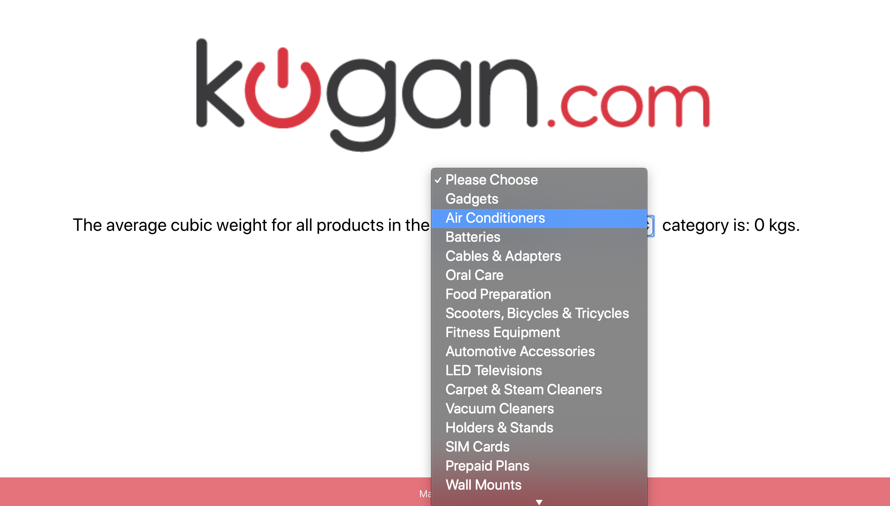
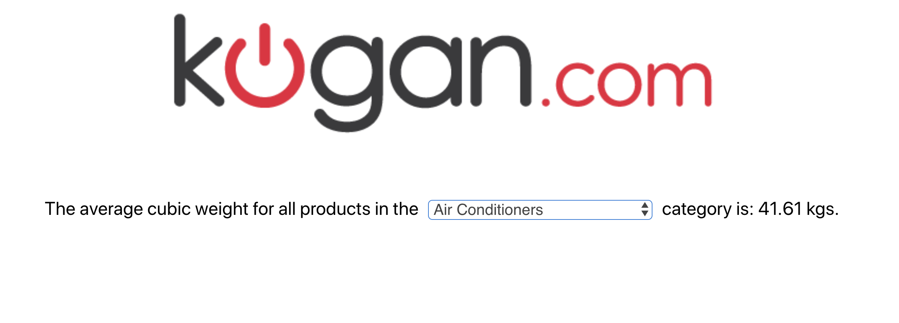

### `PROJECT STACK`

Thank you for the opportunity to send you this.

This project is bootstrapped with [Create React App](https://github.com/facebook/create-react-app), and written in **TypeScript**.

### `First: Install Packages`

From the root directory run `yarn install` to install the dependencies.

### `Run the server with yarn start`

Once the dependencies have been installed, you can `yarn start` from the root directory via terminal, and the server will start. It will also open a browser automatically and render the page.

Runs the app in the development mode. 
Open [http://localhost:3000](http://localhost:3000) to view it in the browser.

The page will reload if you make edits. 
You will also see any lint errors in the console.

Here is a screenshot of the UI

Then after a category is selected...

### `PROXY SERVER`

As CORS was not enabled on the API endpoint (`http://wp8m3he1wt.s3-website-ap-southeast-2.amazonaws.com/api/products/1`) I created a proxy server that fetches it. Thus data in this App is fetched from the proxy, which fetches it from the endpoint.

The proxy server is at `https://kgnserver--zubinpratap.repl.co/data`. It should cold start upon receiving a get request, even if you don't navigate to the server repl at the link below.

The code for the proxy server is at the following repl.it location : https://repl.it/@ZubinPratap/KGNServer. Hit the `START` button to fire up the server.

### `yarn test`

Launches the test runner in the interactive watch mode. 
Tests are in `src/utils/testutils.test.js`
